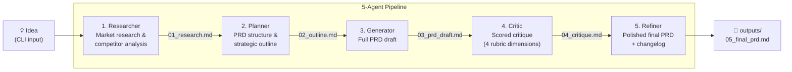

# multi-agent-prd-generator

 

A 5-agent pipeline that transforms a one-line idea into a full Product Requirements Document (PRD). Built with the Anthropic SDK to learn multi-agent harness design.

## Architecture



Each agent writes its output to `outputs/` as a numbered Markdown file. The next agent reads only its immediate upstream file — keeping context lean and the pipeline inspectable at every step.

## Quickstart

```bash
# 1. Clone and install
git clone https://github.com/Eiji1202/multi-agent-prd-generator
cd multi-agent-prd-generator
npm install

# 2. Set your API key
cp .env.example .env
# Edit .env and set ANTHROPIC_API_KEY=sk-ant-...

# 3. Run the pipeline
npm run dev -- "A habit tracking app for remote teams"
```

### Example output

```
┌─────────────────────────────────────────────┐
│       Multi-Agent PRD Generator             │
└─────────────────────────────────────────────┘

Idea: "A habit tracking app for remote teams"

Pipeline:
  1. Researcher  → outputs/01_research.md
  2. Planner     → outputs/02_outline.md
  3. Generator   → outputs/03_prd_draft.md
  4. Critic      → outputs/04_critique.md
  5. Refiner     → outputs/05_final_prd.md

[11:00:01] [Researcher] Starting research for: "A habit tracking app..."
[11:00:18] [Researcher] Done in 17.2s → outputs/01_research.md
[11:00:18] [Planner] Reading research report...
...
[11:02:44] [Refiner] Done in 21.3s → outputs/05_final_prd.md

✓ Done!
  Completed agents: Researcher → Planner → Generator → Critic → Refiner
  Final PRD: outputs/05_final_prd.md
```

## Directory Structure

```
src/
├── agents/
│   ├── researcher.ts   # Agent 1: market research
│   ├── planner.ts      # Agent 2: PRD structure
│   ├── generator.ts    # Agent 3: full PRD draft
│   ├── critic.ts       # Agent 4: scored critique
│   └── refiner.ts      # Agent 5: polished final PRD
├── pipeline/
│   └── orchestrator.ts # Sequential runner with resume support
├── types/
│   └── index.ts        # Shared TypeScript interfaces
└── utils/
    ├── fileIO.ts        # Read/write with metadata headers
    ├── fileUtils.ts     # Low-level file helpers
    ├── logger.ts        # Timestamped agent logger
    └── tokenEstimator.ts# Context window usage estimation
outputs/                 # Generated Markdown files (gitignored)
docs/
├── architecture.md      # Deep-dive on each agent
├── context-design.md    # Context management strategy
├── evaluation-rubric.md # Critic scoring rubric
└── learnings.md         # Multi-agent design observations
```

## Docs

- [Architecture deep-dive](docs/architecture.md)
- [Context management strategy](docs/context-design.md)
- [Critic evaluation rubric](docs/evaluation-rubric.md)
- [Multi-agent design learnings](docs/learnings.md)

## References

- [Harness design for long-running apps — Anthropic Engineering](https://www.anthropic.com/engineering/harness-design-long-running-apps)
